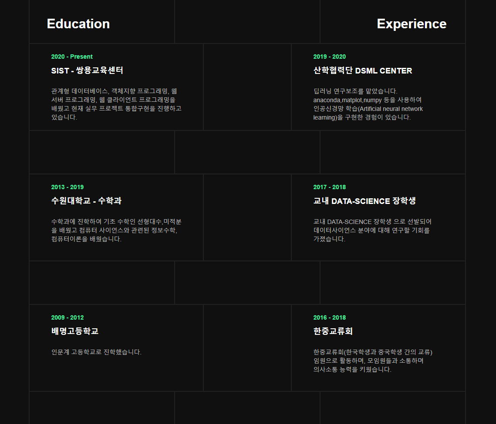
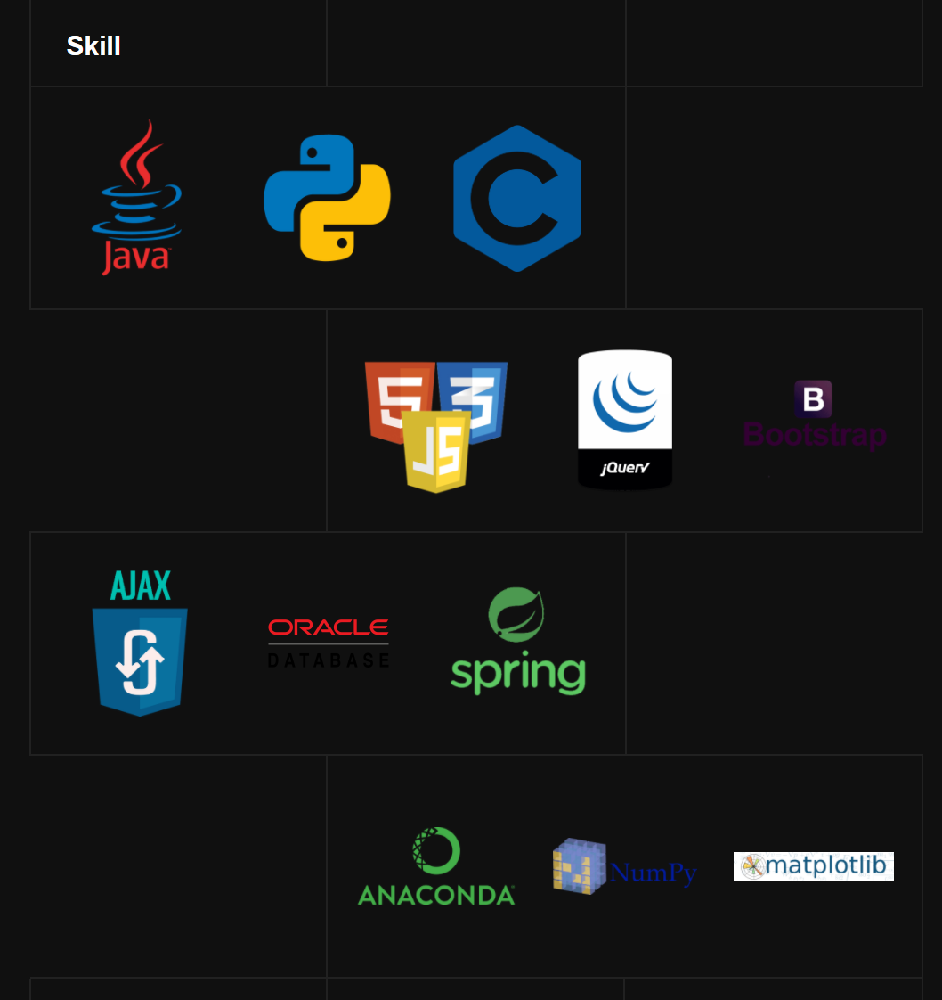
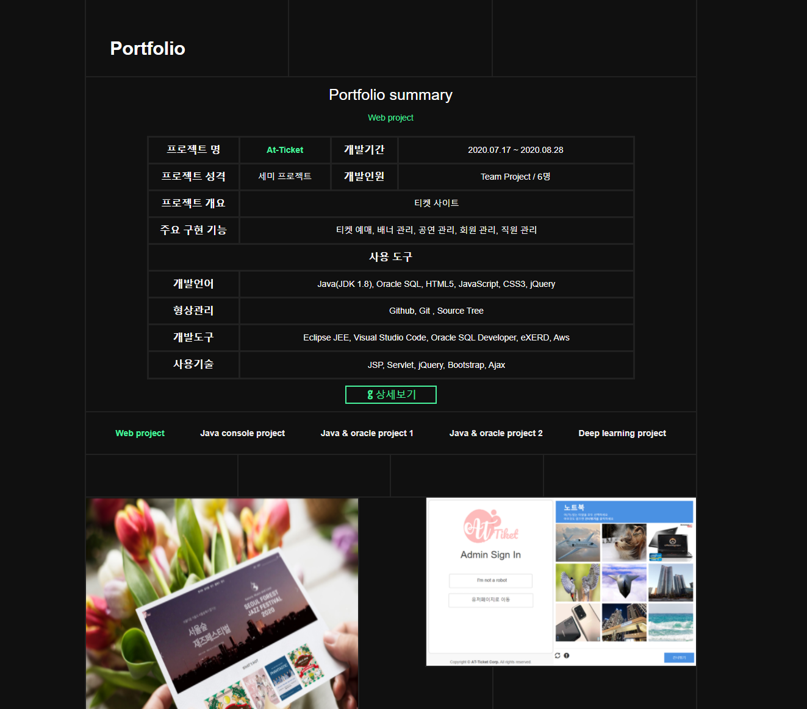
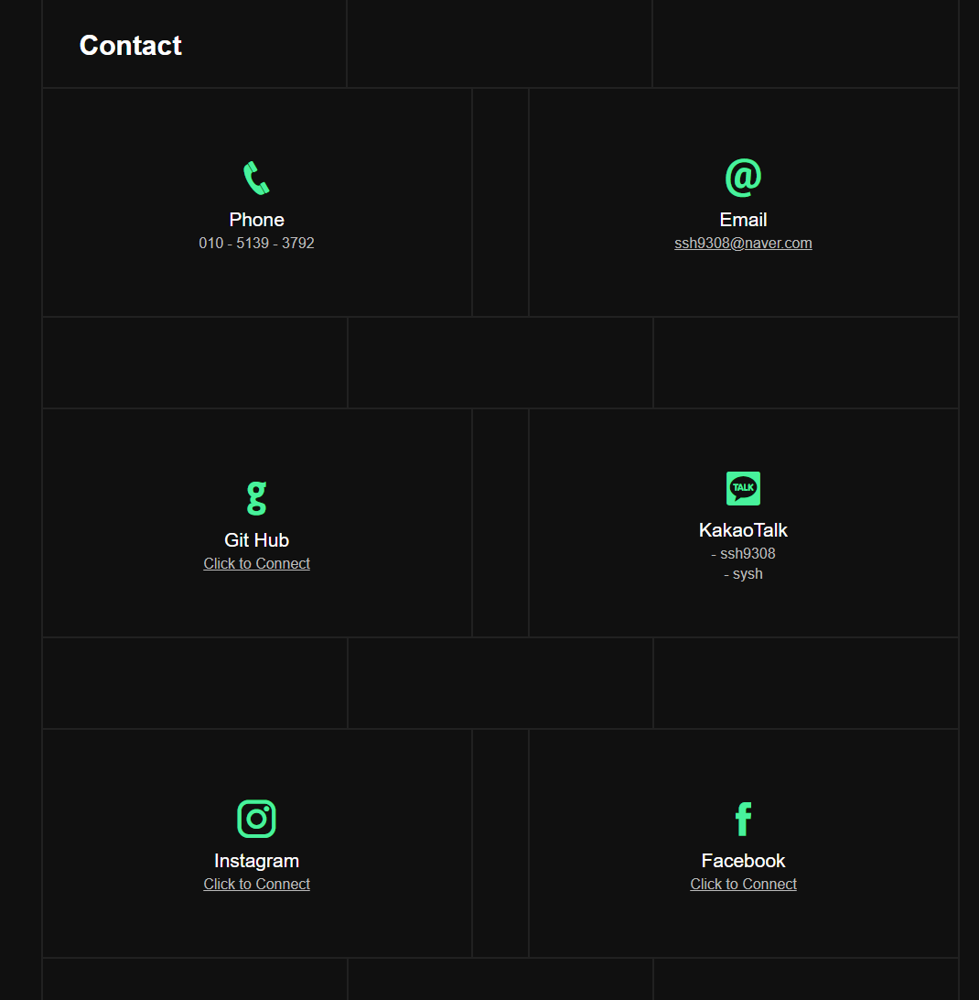

# Seung Hwan Shin's Portfolio

**신승환의 포트폴리오 | [▶ Preview](https://sexyseunghwan.github.io/myportfolio2/)** 

### 👋 Introduction

<table>
    <tr>
        <th>프로젝트명</th>
        <th>Portfolio</th>
        <th>개발 기간</th>
        <th>2020.09.01. ~ 2020.09.06.</th>
    </tr>
    <tr>
        <th>프로젝트 성격</th>
        <th>토이 프로젝트</th>
        <th>개발 인원</th>
        <th>개인 / 1명</th>
    </tr>
    <tr>
        <th>프로젝트 개요</th>
        <th>싱글페이지 포트폴리오 웹 사이트</th>
        <th>개발 환경</th>
        <th>Windows10</th>
    </tr>
    <tr>
        <th colspan="4">사용한 Skill 또는 지식</th>
    </tr>  
    <tr>
        <th>개발언어</th>
        <th colspan="3">HTML5, JavaScript, CSS3</th>
    </tr>
    <tr>
        <th>형상관리</th>
        <th colspan="3">Github, Git Bash, Source Tree</th>
    </tr>
    <tr>
        <th>개발도구</th>
        <th colspan="3">Visual Studio Code, Github Pages, Kakao Oven</th>
    </tr>
    <tr>
        <th>사용기술</th>
        <th colspan="3">jQuery, Bootstrap</th>
    </tr>
</table>

### 📷 Appearance

Git Pages와 HTML5, CSS3, JavaScript를 이용한 싱글페이지 포트폴리오 정적 웹 사이트입니다.

<table>
    <tr>
        <th>About</th>
        <th>Experience & Eduction</th>
        <th>Strength</th>
    </tr>
    <tr>        
        <td></td>
        <td></td>
        <td></td>
    </tr>
        <tr>
        <th>Skills</th>
        <th>Portfolio</th>
        <th>Contact</th>
    </tr>
    <tr>
        <td></td>
        <td></td>
        <td></td>
    </tr>
</table>

# myportfolio2
